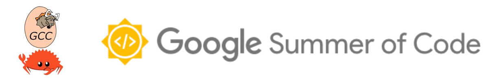

## Google Summer of Code 2024 : Final report
**Student :** [Kushal Pal](https://github.com/braw-lee)

**Organization :** GNU Compiler Collection (GCC)

**Project :** [Borrow-checking IR location support](https://summerofcode.withgoogle.com/programs/2024/projects/DPiEgdZa)

**Mentors :** [Arthur Cohen](https://github.com/CohenArthur), [Pierre-Emmanuel Patry](https://github.com/P-E-P)

---
### Description
The main goal of this project is to add location support in GCC Rust, to BIR i.e an 
intermediate representation that will be exclusively used by the borrow checker to 
perform checks using the Polonius engine i.e, a rust library that models the borrow-checker. 
Previously the borrow-checker could return some basic borrow checking errors but couldn't 
display what or where exactly the problem occurred. By adding source code location to the 
BIR and BIR builder and updating the testsuite, we can ensure compilation fails for the 
right reasons and return useful error messages to the user.

---
### Work done
#### Copying results of Polonius
GCCRS is using Polonius i.e a rust library that models the borrow-checker.
To use the results of Polonius, we need to transfer the results from rust to C++ side.
This requires interaction between rust and C++.
The results computed by Polonius were in the form of vectors, so we created a wrapper struct 
around `std::vector` named `FFIVector<T>` with a few helper functions.
Next, we used the C ABI provided by rust and C++ to create a foreign function interface
so we can call C++ methods inside rust code.
These functions allocated memory on C++ side and copied data from rust side to C++ side.  
Related pull request:
- https://github.com/Rust-GCC/gccrs/pull/3058

#### New class to handle borrow-checking errors
Created a new class `BorrowCheckerDiagnostics` so that we can seperate the borrow-checker code
with diagnostics code. For diagnostics we will require the BIR and HIR representation of the
functions for which we are currently reporting errors for, collected facts that were used by
Polonius and results computed by Polonius. All the future work related to providing helpful
borrow-checking errors to user will be handled by this class.   
Related pull request:
- https://github.com/Rust-GCC/gccrs/pull/3076

#### Added location to BIR statements
To point to the source code which causes the error, we need to add location support to BIR nodes.
Polonius gives us result in terms of which statement caused error due to which loan.
Therefore location support to `BIR::Statement` and `BIR::Loan` was added.
Most errors occur due to an assigment statements in BIR, so initally, we added location support for
assigment statements.  
Related pull request:
- https://github.com/Rust-GCC/gccrs/pull/3013

#### Better loan errors
We now have results from Polonius and have added location to some BIR::Statements, so we can
start updating borrow-checking errors to make them more user-friendly.
Loan errors arise due to invalidating action in between two uses of a reference.
Polonius gives us the point which causes error and the loan that was invalidated.
We used these points to label source code locations while generating errors.
We also added location support to return statements in BIR.

Lets take an example code and see the difference between generated errors, before and after.

We will be using the following command to run the compiler:
```bash
$ gcc/crab1 <rust_file_name> -frust-incomplete-and-experimental-compiler-do-not-use -frust-borrowcheck
```

```rust
// example_1.rs                                                                                                                
fn immutable_borrow_while_mutable_borrowed() {
    let mut x = 0;                                                                                                             
    let y = &mut x;                                                                                                            
    let z = &x;                                                                                                                
    let w = y;                                                                                                                 
}
```
Before:
```
example_1.rs:2:1: error: Found loan errors in function immutable_borrow_while_mutable_borrowed
    2 | fn immutable_borrow_while_mutable_borrowed() {
      | ^~
```

After:
```
example_1.rs:5:13: error: use of borrowed value
    4 |     let y = &mut x;
      |             ~
      |             |
      |             borrow occurs here
    5 |     let z = &x;
      |             ^
      |             |
      |             borrowed value used here
```
Related pull requests:
- https://github.com/Rust-GCC/gccrs/pull/3088

#### Better move errors
These errors arise when we try to use a variable that was moved previously.
We used some previously generated facts to label all the moves for the path causing
error.
```rust
// example_2.rs
fn test_move() {
    struct A {
        i: i32,
    }
    let a = A { i: 1 };
    let b = a;
    let c = a;    
}    
```
Before:
```
example_2.rs:2:1: error: Found move errors in function test_move
    2 | fn test_move() {
      | ^~
```

After:
```
example_2.rs:8:13: error: use of moved value
    7 |     let b = a;
      |             ~
      |             |
      |             value moved here
    8 |     let c = a;
      |             ^
      |             |
      |             moved value used here
```

Related pull requests:
- https://github.com/Rust-GCC/gccrs/pull/3128
- https://github.com/Rust-GCC/gccrs/pull/3130

#### Better subset errors
These errors arise due to missing relationships between placeholder origins.
Polonius generates multiple error points for the same placeholder origin pair,
so currently we cannot determine the correct location that is causing the error.
So for now we will add labels to the placeholder origins only.

```rust
// example_3.rs
fn complex_cfg_subset<'a, 'b>(b: bool, x: &'a u32, y: &'b u32) -> &'a u32 {                                                    
    if b {    
        y    
    } else {    
        x    
    }    
} 
```
Before:
```
example_3.rs:2:1: error: Found subset errors in function complex_cfg_subset. Some lifetime constraints need to be added.
    2 | fn complex_cfg_subset<'a, 'b>(b: bool, x: &'a u32, y: &'b u32) -> &'a u32 {
      | ^~
```

After:
```
example_3.rs:2:1: error: subset error, some lifetime constraints need to be added
    2 | fn complex_cfg_subset<'a, 'b>(b: bool, x: &'a u32, y: &'b u32) -> &'a u32 {
      | ^~                    ~~  ~~
      | |                     |   |
      | |                     |   lifetime defined here
      | |                     lifetime defined here
      | subset error occurs in this function
```

Related pull requests:
- https://github.com/Rust-GCC/gccrs/pull/3113

#### Bitwise bug
Incorrect bitwise operations were used to extract specific bits.
This was fixed and verbose description of the extraction of bits
was also added.  
Related pull requests:
- https://github.com/Rust-GCC/gccrs/pull/3100
- https://github.com/Rust-GCC/gccrs/pull/3112

---
### Whats left
#### Strong types
We had some issues because of using type aliases. So to get rid of some troublesome
typedefs / type aliases, these aliases were strongly typed.
Strong types help us to better express our intentions to the compiler.
To use strong types as indexes of a vector, a new class name `IndexVec`, inspired from rust, was introduced.
This pull request is still under review.  
Related pull requests:
- https://github.com/Rust-GCC/gccrs/pull/3122

---
### Whats next
- A lot more work can be done on top of this project, we can update the BIR builder with more 
and more information about the code which can be used to provide more specific errors to the end users.
- Location support can be added to remaining BIR::Statements as per need.
- We cannot point to the location of error for subset errors, lot more work is needed for this.
- For loan errors, we should inform the user about the later use of borrowed value.

---
### All pull requests related to the project
- https://github.com/Rust-GCC/gccrs/pull/3058
- https://github.com/Rust-GCC/gccrs/pull/3076
- https://github.com/Rust-GCC/gccrs/pull/3100
- https://github.com/Rust-GCC/gccrs/pull/3112
- https://github.com/Rust-GCC/gccrs/pull/3013
- https://github.com/Rust-GCC/gccrs/pull/3088
- https://github.com/Rust-GCC/gccrs/pull/3128
- https://github.com/Rust-GCC/gccrs/pull/3130
- https://github.com/Rust-GCC/gccrs/pull/3113
- https://github.com/Rust-GCC/gccrs/pull/3122

---
### Learnings
- Working on a huge codebase alongside professional developers was a great experience.
- Worked with many new concepts, one of the interesting ones was FFI mechanism,
used it to interact between Rust and C++ code.
- Using a simple approach to get work done instead of overcomplicating everything
is something I will always try to apply in future.
- Discovered Rust's unique memory management model, which is really interesting.
- Overall, this was a great learning experience and I enjoyed it.

---
### Acknowledgement
I would like to thank my mentors [Arthur](https://github.com/CohenArthur)
and [Pierre-Emmanuel](https://github.com/P-E-P) for their guidance and support.
I am grateful for the time and effort you have invested in mentoring me.
Also I would like to thank [Jakub](https://github.com/jdupak) for his valuable 
insights, this work was done on top of the initial borrow-checker work done by 
him.
